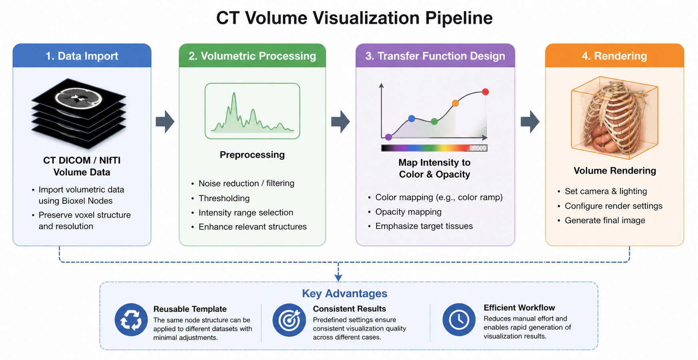
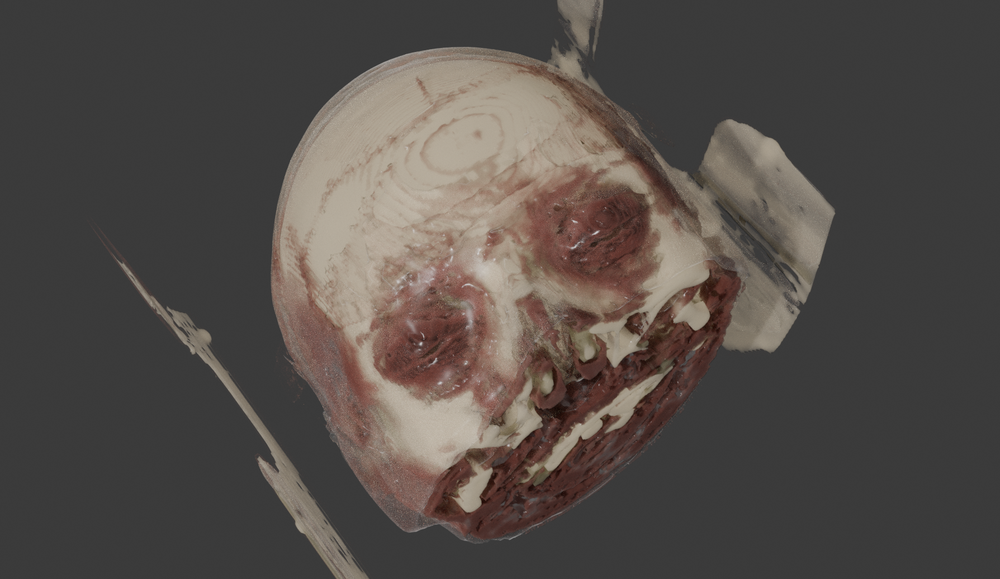
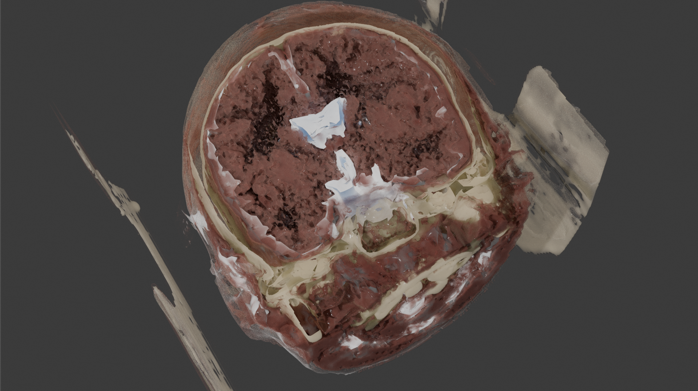
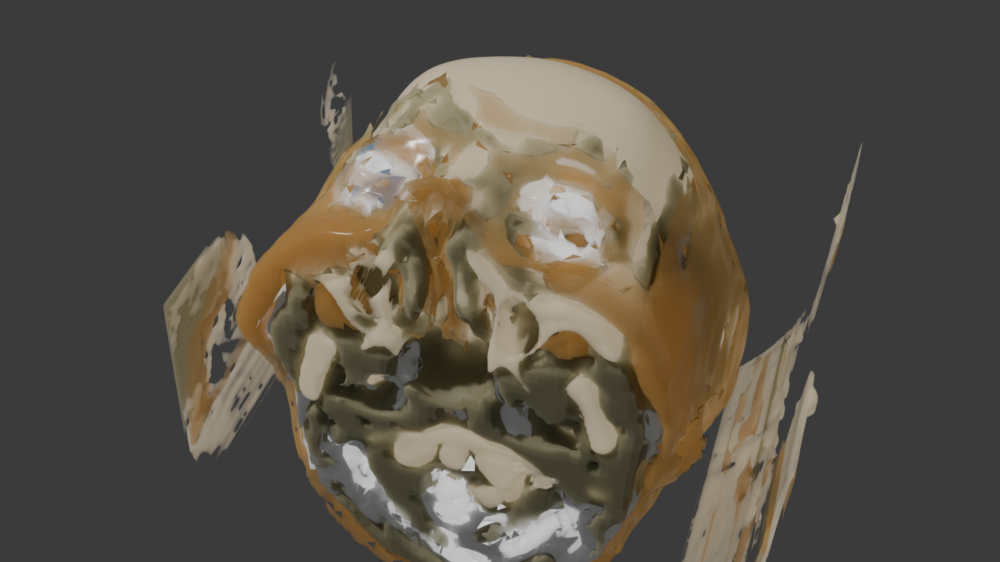
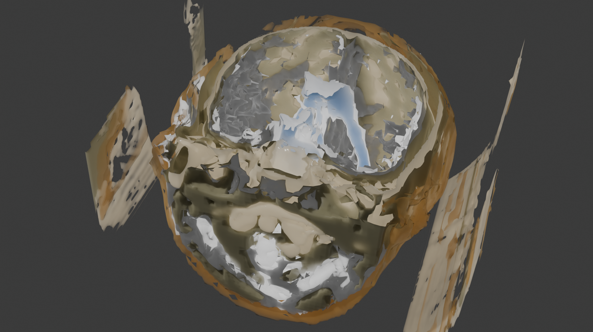

# 3D CT Image Visualization using Blender

This project presents a reusable CT visualization workflow developed in Blender using Bioxel Nodes.

The workflow enables automated rendering and color mapping of volumetric CT datasets through reusable node-based templates.

---

## Features

- Node-based visualization pipeline
- Reusable Blender templates
- Soft tissue visualization
- Brain structure visualization
- Adjustable rendering parameters
- Slice-based exploration using plane cutters

---

## Software

- Blender
- Bioxel Nodes

---

## Workflow

  

  <em>Overview of the reusable visualization workflow developed in Blender using Bioxel Nodes.</em>

---

## Example Results

### Soft Tissue Visualization

  
  

  <em>Soft tissue visualization with and without sectional slicing.</em>

---

### Brain Structure Visualization

  
  

  <em>Brain-oriented visualization showing internal structures and slice-based exploration.</em>

---

## Blender Templates

- `brain_visualization_template.blend`
- `soft_tissue_visualization_template.blend`

These templates contain predefined node structures, rendering parameters, and visualization settings for reusable CT visualization workflows.

---

## Author

Shen Gao
